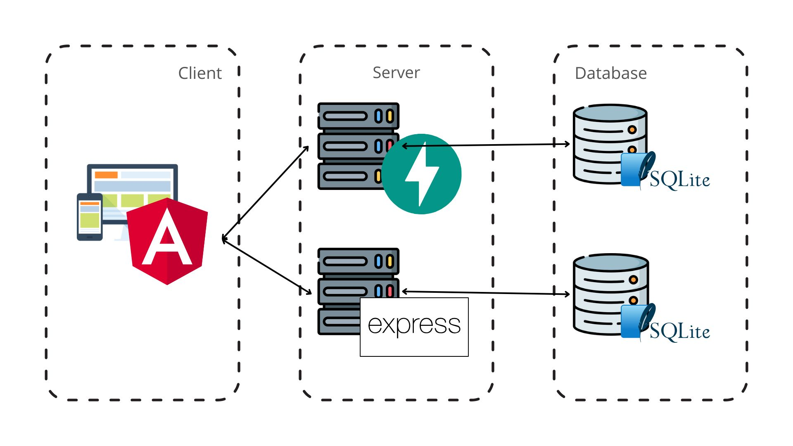

# Taskly

## Descripcion del proyecto

Es una aplicacion web que permite gestionar tus propias tareas (Crear, editar o eliminar), ademas de una autenticacion dependiendo de roles con sus respectivos permisos (admin o user):

- **Admin** pueden administrar todas las tareas del sistema.
- **User** pueden administrar sus propias tareas.

## Herramientas

[](#)
[](#)
[](#)
[](#)
[](#)
[](#)
[](#)
[](#)

## Despliegue

- **Frontends:** Desplegados en **Netlify**.
  - [Portal](https://luminous-starship-eb26e8.netlify.app/)
- **Backends:** Desplegados en **Render**.
  - [Servicios Web Usuarios](https://taskly-euyg.onrender.com/api-docs)
  - [Servicios Web Tareas](https://taskly-1-t7vy.onrender.com/docs)

> [!WARNING]
> Como son servidores gratuitos, el primer llamado al servidos despues de 7 minutos inactivo tendra una latencia alta en responder.

## Estructura del proyecto



### **Angular**

- **Autenticacion:** Inicio se sesion, registro, restablecer contraseña.
- **Dashboard:** Dinamico dependiendo del rol.
- **Adaptable:** Diseño responsive a cualquier pantalla.
- **Notificaciones:** Mensajes de exito y error.
- **Pruebas unitarias:** Verificacion de codigo.
- **Template:** Basado gran parte en el template [Colorlib](https://colorlib.com/polygon/adminator/index.html).

### **Express**

- **Gestion de autenticación:** Crear, editar y eliminar usuarios.
- **Almacenamiento:** Con base de datos PostgreSQL.
- **Arquitectura:** Con arquitectura monolito.
- **Comunicación:** Con REST.
- **Proteccion:** Por jsonwebtoken y bcrypt.
- **Respuestas:** Con el codigo de estado y mensaje descriptivo.
- **Documentacion:** Por Swagger.

#### Base de Datos

- **Tabla `users`**  
  Almacena la información de los usuarios registrados en el sistema.

  - `id` (`INTEGER`, clave primaria, autoincremental) – Identificador único del usuario.
  - `email` (`TEXT`, único, no nulo) – Correo electrónico del usuario.
  - `password` (`TEXT`, no nulo) – Contraseña encriptada del usuario.
  - `rol` (`TEXT`, no nulo) – Rol del usuario en el sistema (ejemplo: "admin", "usuario").

### **FastAPI**

- **Gestion de tareas por usuarios:** Crear, editar y eliminar tareas.
- **Almacenamiento:** Con base de datos SQLite3.
- **Arquitectura:** Con arquitectura monolito.
- **Comunicación:** Con REST.
- **Proteccion:** Por header API_KEY.
- **Respuestas:** Con el codigo de estado y mensaje descriptivo.
- **Documentacion:** Por Swagger.

#### Base de Datos

- **Tabla `task`**  
  Contiene las tareas creadas por los usuarios.

  - `id` (`INTEGER`, clave primaria, autoincremental) – Identificador único de la tarea.
  - `title` (`TEXT`, no nulo) – Título de la tarea.
  - `description` (`TEXT`, opcional) – Descripción detallada de la tarea.
  - `user_email` (`TEXT`, clave foránea) – Correo electrónico del usuario que creó la tarea.
  - `status` (`TEXT`, no nulo) – Estado de la tarea "pendiente", "en progreso", "completada".
  - `created` (`DATETIME`, no nulo) – Fecha y hora de creación de la tarea.
  - `updated` (`DATETIME`, no nulo) – Fecha y hora de actualización de la tarea.

## Ejecución Local

### Ejecución Individual

Cada carpeta en el directorio raíz (`angular`, `express`, `fastapi`) contiene un README con instrucciones detalladas y comandos para configurar y ejecutar cada parte del proyecto localmente.

### Ejecución con Docker Compose

Para ejecutar todos los proyectos de forma paralela:
1. Asegúrate de tener instalado [Docker Desktop](https://www.docker.com/products/docker-desktop/).
2. Ejecuta el siguiente comando desde la raíz del proyecto:

```bash
    docker-compose up
```

Esto iniciará todos los servicios (frontends y backends) en contenedores Docker.

## Extra

Las bases de datos de Express y FastAPI son **independientes** y se utilizan según sus respectivas funciones:

- **Express** gestiona la autenticación de `user`.
- **FastAPI** administra las `task`.

Para asegurarse de que solo los usuarios registrados puedan crear tareas, FastAPI realizará una solicitud `HTTP` a Express para verificar si el email del usuario existe en la tabla user. Si el usuario es válido, la tarea se creará con éxito.

> [!TIP]
> En la url cambia la palabra **github** por **gitingest** para visualizar la estructura de carpetas completa y todo el contenido HTML.

> [!TIP]
> En la url cambia la palabra **github** por **gitdiagram** para visualizar el diagrama de componentes y sus relaciones.

> [!WARNING]
> La IAS utilizada para la ejecucion de los proyectos backend es **Rendder**, en cada redeploy se borran los archivos, consecuencia de que los datos almacenados como **usuarios** seran borrados pero por prototipo se desea continuar hasta encontrar una solucion gratuita y viable.

## Autor

**Andrés Orozco**

- [GitHub](https://github.com/AndresOrozcoDev)
- [LinkedIn](https://www.linkedin.com/in/andresorozcodev/)

---
